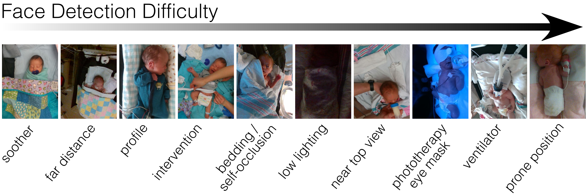

# NICUface
NICUface: Robust Neonatal Face Detection in Complex NICU Scenes



## Models

|     Model       |     Backbone        | Weights           |
| :-------------: | :-----------------: | :---------------: |
| NICUface-RF     | RetinaFace          | Link:    |
| NICUface-Y5F    | YOLO5Face (YOLOV5l) | Link: https://drive.google.com/file/d/16-OEMYuAuaNyd3vUcmlw1aCWsQHtDAYt/view?usp=sharing |
| FaceOrientation | YOLO5Face (YOLOV5l) | Link: https://drive.google.com/file/d/1IvPdph3ghr6bVJp4HEbAMJZ1ZiID4sAM/view?usp=sharing |

## NICUface Training
Two models are presented here for neonatal face orientation: NICUface-RF based on RetinaFace, and NICUface-Y5F based on YOLO5Face. We strongly recommend users to try both models for their neonatal application given that they are highly complementary in detecting diverse complex NICU scenes.

### NICUface-RF Training


### NICUface-Y5F Training
1. Data preprocessing: Face orientation estimation to standardize images.
```
python3 face_orientation_estimation.py --image_directory
```
This will create a ```north_oriented_faces``` directory with the supplied images from ```image_directory``` with faces oriented North.

2. Prepare your data into a new ```neonate``` directory as:
```
data/neonate/
    train/
      images/
      label.txt
    val/
      images/
      label.txt
```

3. Download YOLO5face repo
```
https://github.com/deepcam-cn/yolov5-face.git 
``` 

4. Download NICUface repo
```
https://github.com/GreenCUBIC/NICUface.git
```

5. Download NICUface-Y5F weights (presented in table above)

6. Train model
```
python3 train_nicuface_y5f.py --data data/neonate.yaml --cfg models/nicuface_y5f.yaml --weights weights/nicuface_y5f.pt --hyp data/hyp.nicuface_y5f.yaml
```

## Testing
After training, the resulting weights are saved under ```runs/train/exp1/last.pt``` and can be used in inference as:
``` 
test_nicuface_y5f.py --runs/train/exp1/last.pt 
```

## NICUface Evaluation


## Citation

## Contact

